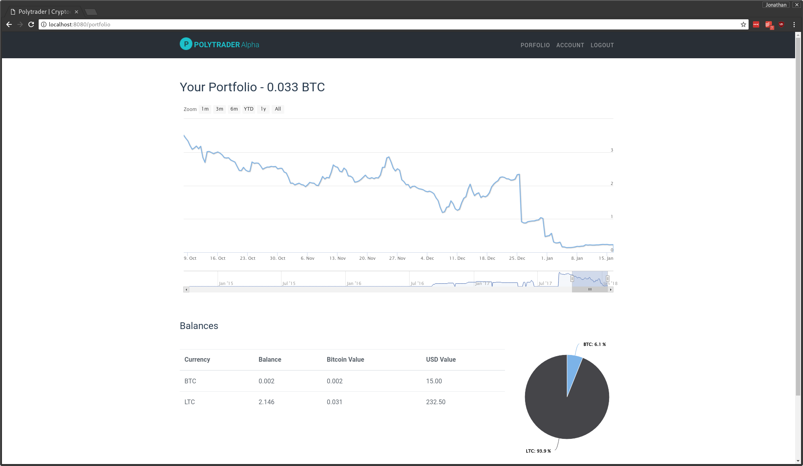

# polytrader

A simple website to analyse poloniex trading history

You will need docker and docker-compose installed

    # Start the server
    $ docker-compose up

    # Start watching files for changes
    $ webpack --watch

This will build the necessary containers and launch them. You may have to wait for the currency histories to be loaded into the database. This can take several hours depending on your internet connection.

